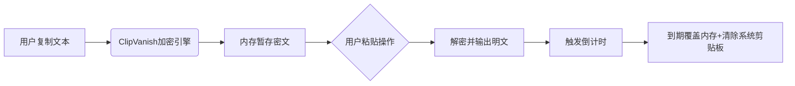

### **项目名称：ClipVanish™**  
**定位**：全球首款「物理级自毁」剪贴板工具，实现隐私数据的秒级自动销毁  

---

### 一、产品核心价值  
**解决痛点**：  
- 敏感信息（密码、密钥、身份号）复制后残留剪贴板，被恶意软件窃取  
- 现有剪贴板管理工具无强制销毁机制，依赖手动清理  

**关键创新**：  
✅ **倒计时自毁**：粘贴后自动倒计时销毁（默认30秒）  
✅ **物理级清除**：覆盖内存+剪贴板缓存（非简单清空）  
✅ **跨平台支持**：Windows/macOS/Linux/Android（首期MVP聚焦桌面端）  

---

### 二、MVP功能列表  
#### **核心功能**  
| 功能模块          | 详细描述                                                                 | 优先级 |  
|-------------------|--------------------------------------------------------------------------|--------|  
| **加密剪贴**      | 用户复制时自动加密内容（AES-256），明文仅存于内存                        | P0     |  
| **倒计时销毁**    | 粘贴后触发倒计时（可设5s/30s/1min），到期彻底清除内存及系统剪贴板缓存    | P0     |  
| **一键紧急销毁**  | 快捷键（Ctrl+Alt+V）立即擦除所有剪贴数据                                 | P0     |  
| **多格式支持**    | 文本/图片/文件路径（首期仅文本）                                        | P1     |  

#### **辅助功能**  
| 功能模块          | 详细描述                                                                 | 优先级 |  
|-------------------|--------------------------------------------------------------------------|--------|  
| 状态托盘图标      | 显示倒计时进度条，红色闪烁预警                                          | P1     |  
| 销毁历史记录      | 仅记录销毁时间+内容长度（不存具体内容）                                  | P2     |  
| 白名单应用        | 指定某些应用（如密码管理器）粘贴时不触发销毁                             | P2     |  

---

### 三、技术实现方案  
#### **架构设计**  


#### **关键技术栈**  
| 组件              | 技术选型                          | 说明                                |  
|-------------------|-----------------------------------|-------------------------------------|  
| 加密引擎          | Rust (使用aes-gcm-siv算法)        | 避免时序攻击，内存零残留            |  
| 剪贴板监听        | Windows：Win32 API<br>macOS：NSPasteboard | 原生级性能，无依赖                  |  
| 内存管理          | 自定义内存池 + mlock()            | 阻止Swap泄露                        |  
| 安装包            | Tauri (Rust + WebView)            | 单文件≤5MB，无Node依赖              |  

#### **安全设计**  
- **内存防护**：`mlock()` 锁定敏感内存，禁止换出到磁盘  
- **防截屏**：粘贴时模糊背景（仅Windows）  
- **自毁验证**：倒计时结束后填充0x00 + 随机噪声覆盖原数据  

---

### 四、界面原型（命令行MVP版）  
为快速验证，首版采用命令行交互：  
```bash
# 启动监听
$ clipvanish start --timer 30

[ClipVanish] 监听中... 自毁倒计时: 30s
[!] 已加密剪贴板内容 (长度: 24字节)
[!] 用户粘贴操作 → 倒计时启动: 30...29...28...
[√] 倒计时结束! 已销毁数据并清除剪贴板

# 紧急销毁所有数据
$ clipvanish nuke
[!] 内存数据已覆盖3次! 剪贴板已重置
```

---

### 五、开发计划（2周上线）  
```mermaid
gantt
    title ClipVanish MVP开发计划
    dateFormat  YYYY-MM-DD
    section 核心功能
    Rust加密模块       ：done,    des1, 2025-08-01, 3d
    Win/mac剪贴板监听  ：active, des2, 2025-08-04, 4d
    倒计时销毁引擎     ：         des3, 2025-08-08, 3d
    section 测试发布
    渗透测试（内存取证）：         des4, 2025-08-11, 2d
    GitHub开源发布    ：         des5, 2025-08-13, 1d
```

---

### 六、验证指标  
| 指标                | 目标值                  | 测量方式                     |  
|---------------------|-------------------------|------------------------------|  
| 销毁可靠性          | 100%覆盖（内存取证验证）| 使用Volatility检测内存残留   |  
| 性能影响            | 复制延迟≤0.1s          | 高速摄像机录制操作           |  
| 用户获取            | 首周500+ GitHub Stars   | 推广至Reddit r/privacy       |  

---

### 七、商业化路径  
| 阶段   | 策略                          | 收入模型                  |  
|--------|-------------------------------|---------------------------|  
| MVP期  | GitHub开源 + 免费下载         | 接受捐赠（GitHub Sponsors）|  
| V1.0   | 上架Microsoft Store/Homebrew  | 基础功能免费，高级版$4.99 |  
| 企业版 | 增加AD域控/SIEM集成           | 订阅制 $9.9/设备/年       |  

---

立即行动建议：  
1. 用Rust+Tauri在1天内搭建基础监听框架；  
2. 在Reddit的r/rust发布演示视频，标题“I built a clipboard that self-destructs - thoughts?” 收集反馈。  
3. 渗透测试方案：使用**Magnet RAM Capture**验证内存残留。  
